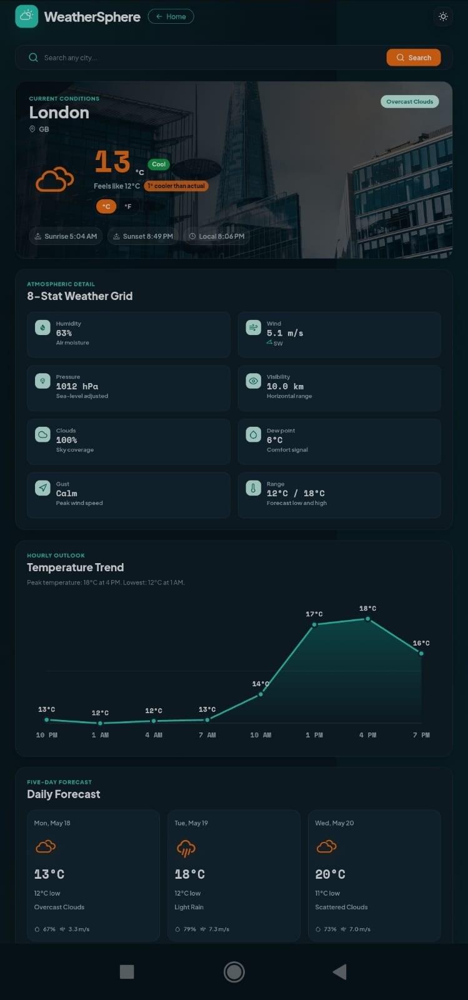

# Global Weather Dashboard

A responsive weather dashboard for searching global cities, viewing live forecasts, country details, comfort scores, saved searches, and theme-aware weather insights.

## Live Demo

- Live Demo: https://weather-dashboard-sable-two.vercel.app/
- GitHub Repository: https://github.com/Jafor07/weather-dashboard

## Features

- City-based weather search with optional country code/name support
- Current weather dashboard with live conditions
- Five-day forecast cards
- Temperature trend chart
- Country profile card with flag and regional data
- Outdoor comfort score shown as a clear `/100` rating
- Recent search history using local storage
- Invalid city and API error states
- Dark/light theme toggle
- Responsive desktop and mobile UI
- Vercel-ready production build

## Tech Stack

| Tool | Purpose |
| --- | --- |
| React | Component-based UI |
| Vite | Development server and production bundling |
| JavaScript | Application logic |
| CSS | Responsive styling, theme variables, and component styles |
| Framer Motion | UI transitions and animations |
| React Icons | Weather and interface icons |
| Axios | API requests |
| OpenWeatherMap API | Current weather and forecast data |
| REST Countries API | Country profile data |
| Unsplash API | Optional city background images |
| Local Storage | Recent search persistence |
| Vercel | Hosting and deployment |

## Getting Started

### Prerequisites

- Node.js 18 or newer
- npm
- OpenWeatherMap API key
- Unsplash access key, optional

### Installation

```bash
git clone https://github.com/Jafor07/weather-dashboard.git
cd weather-dashboard
npm install
cp .env.example .env
npm run dev
```

Open the local Vite URL shown in the terminal, usually `http://localhost:5173/`.

Search examples:

```text
Dhaka
Dhaka, BD
London, GB
London, UK
Paris, France
```

## Environment Variables

| Variable | Description | Required |
| --- | --- | --- |
| `VITE_OWM_KEY` | OpenWeatherMap API key for current weather and five-day forecast requests. | Yes |
| `VITE_UNSPLASH_KEY` | Unsplash access key for optional city background photos. | No |

Example:

```env
VITE_OWM_KEY=your_openweathermap_api_key
VITE_UNSPLASH_KEY=your_unsplash_access_key
```

## Project Structure

```text
weather-dashboard/
|-- public/
|   |-- favicon.svg
|   `-- screenshots/
|       `-- mobile.png
|-- src/
|   |-- components/
|   |-- hooks/
|   |-- services/
|   |-- styles/
|   |   |-- components.css
|   |   |-- global.css
|   |   `-- theme.css
|   |-- utils/
|   |   |-- constants.js
|   |   |-- helpers.js
|   |   |-- imageLibrary.js
|   |   |-- queryParser.js
|   |   `-- weatherIcons.js
|   |-- App.jsx
|   `-- main.jsx
|-- .env.example
|-- .gitignore
|-- eslint.config.js
|-- index.html
|-- package-lock.json
|-- package.json
|-- README.md
|-- vercel.json
`-- vite.config.js
```

## Deployment

### Vercel (recommended)

1. Push the project to GitHub.
2. Import `https://github.com/Jafor07/weather-dashboard` into Vercel.
3. Add `VITE_OWM_KEY` and optional `VITE_UNSPLASH_KEY` in Vercel project environment variables.
4. Use `npm run build` as the build command.
5. Use `dist` as the output directory.
6. Deploy.

## API Reference

| API | Endpoint | Usage |
| --- | --- | --- |
| OpenWeatherMap Current Weather | `https://api.openweathermap.org/data/2.5/weather` | Loads current city weather using `q=city` or `q=city,countryCode`. |
| OpenWeatherMap Five-Day Forecast | `https://api.openweathermap.org/data/2.5/forecast` | Loads three-hour forecast data for daily forecast cards and the temperature trend chart. |
| REST Countries | `https://restcountries.com/v3.1/name/{country}` | Loads country flag, capital, population, currency, language, and region details. |
| Unsplash Search Photos | `https://api.unsplash.com/search/photos` | Loads optional city background images when an Unsplash key is configured. |

## Screenshots




## License

MIT
